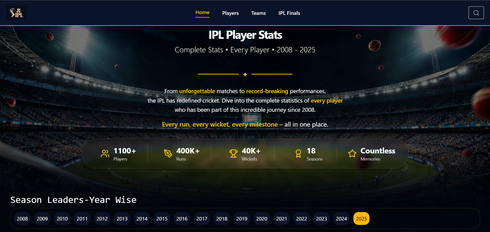
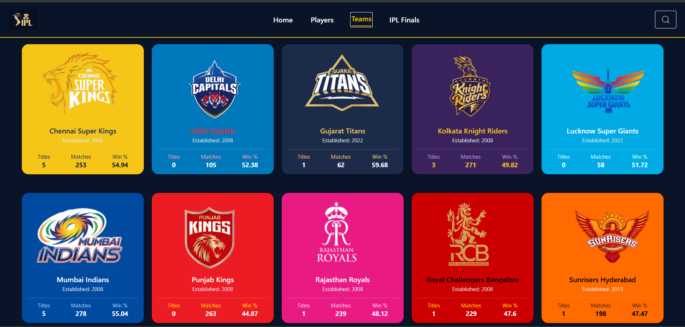
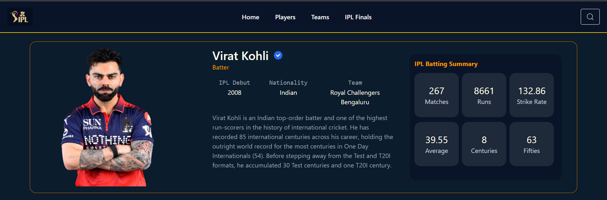
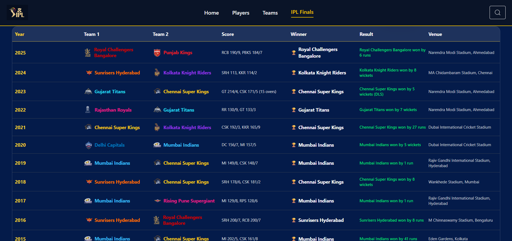

# IPL Cricket StatsHub

A production-ready Full-Stack IPL statistics and analytics platform built using the MERN stack. This platform tracks extensive historical data, individual player career benchmarks, and team performance matrices from 2008 to 2025.

---

## 🚀 Key Features

* **Year-Wise Season Dashboard** – Dynamic main landing dashboard tracking overall league milestones (1100+ Players, 400K+ Runs, 40K+ Wickets) with interactive year-by-year filtering.
* **Comprehensive Team Profiles** – Visually immersive grid layout mapping distinct team identities, total championships won, total matches played, and overall win percentages.
* **Deep Player Analytics** – Detailed historical tracking profiles for individual players featuring automatic verification badges, detailed bio descriptions, and clean summary metric grid blocks.
* **IPL Finals Portal** – Detailed tabular layout documenting the chronological history of all IPL finals including team pairings, final scores, winning margins, and stadium venues.

---

## 📸 Project Previews

### 1. Main Dashboard & Season Leaders


### 2. Team Analytics Grid


### 3. Player Analytics Profile View


### 4. Finals History Ledger


---

## 🛠️ Tech Stack

* **Frontend:** React.js, Tailwind CSS
* **Backend:** Node.js, Express.js
* **Database:** MongoDB
* **State Management:** React Router DOM

---

## 📁 Project Architecture

```text
ipl-cricket-statshub/
├── frontend/          # React.js application workspace
├── backend/           # Node.js & Express API workspace
└── screenshots/       # UI Preview Images
